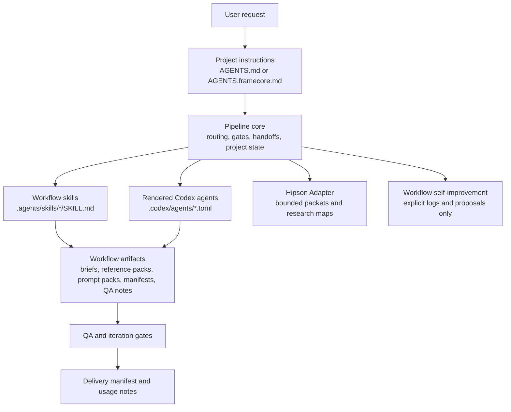

# Architecture

FrameCore Works Skill Kit is a provider-neutral workflow layer for Codex. It installs project-local instructions, role-based agent files, skills, templates, gates, and a manifest so creative work can move through repeatable stages without adding paid execution tooling by default.

## System Layers

## Layer Responsibilities

- Pipeline core: role routing, review gates, handoffs, project state, and artifact templates.
- Production skills: brief, reference, research, direction, copy, prompt, QA, delivery, Humanizer, and HyperFrames workflow knowledge.
- Expansion layer: lightweight Hipson Adapter for research maps, internet mapping packets, bounded instruction packets, review packets, and execution packets.
- Governance layer: explicit workflow self-improvement logs and change proposals. It is report-only unless the user asks for a specific change.

## Installation Model

Project-local install copies only FrameCore-managed files into the target workspace:

- `.agents/skills/<framecore-skill>/...`
- `.codex/agents/<role-id>.toml`
- `AGENTS.md` when no project `AGENTS.md` exists yet
- `AGENTS.framecore.md` when the project already has its own `AGENTS.md`
- `.framecore/manifest.json`

Onboarding writes `framecore.config.json` before installation. The installer reads that file when rendering local agent display names, language, tone, output folder, and QA preference into `.codex/agents/*.toml`.

## Ownership And Safety

The manifest is the source of truth for FrameCore-owned files in a target workspace. Repair and uninstall use `.framecore/manifest.json` to avoid touching user-owned files.

The installer:

- refuses to overwrite user-owned files unless `--force` is explicitly passed;
- backs up existing managed files before rewriting them;
- preserves an existing project `AGENTS.md` by writing `AGENTS.framecore.md`;
- refuses unsafe uninstall paths and directory removals.

## Agent Identity Model

Agent source uses neutral role IDs. Public source files do not contain local personal display names. Onboarding can render local names into a specific target workspace, but those names should not be committed back to this public repo.

## Provider-Neutral Boundary

This repository ships workflow structure, not external paid execution systems. It does not include external paid media-provider clients, API-key flows, endpoint catalogs, or provider CLIs.

The text-bearing image policy is the one intentional exception to a purely textual workflow boundary: when a static raster graphic needs visible text, the workflow routes to the native Codex or ChatGPT image generation capability powered by GPT Image 2, with all visible text generated in one pass.
